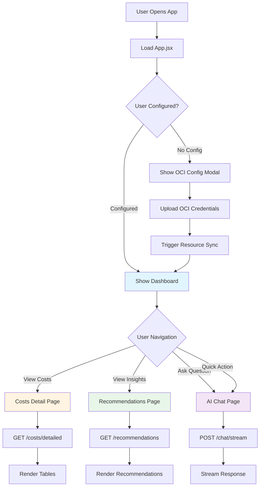
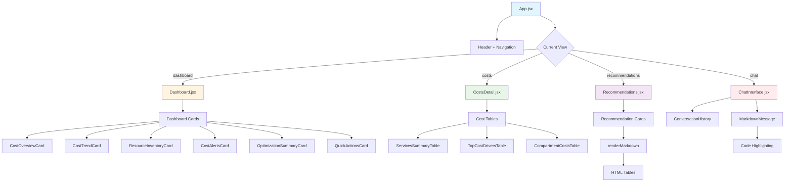
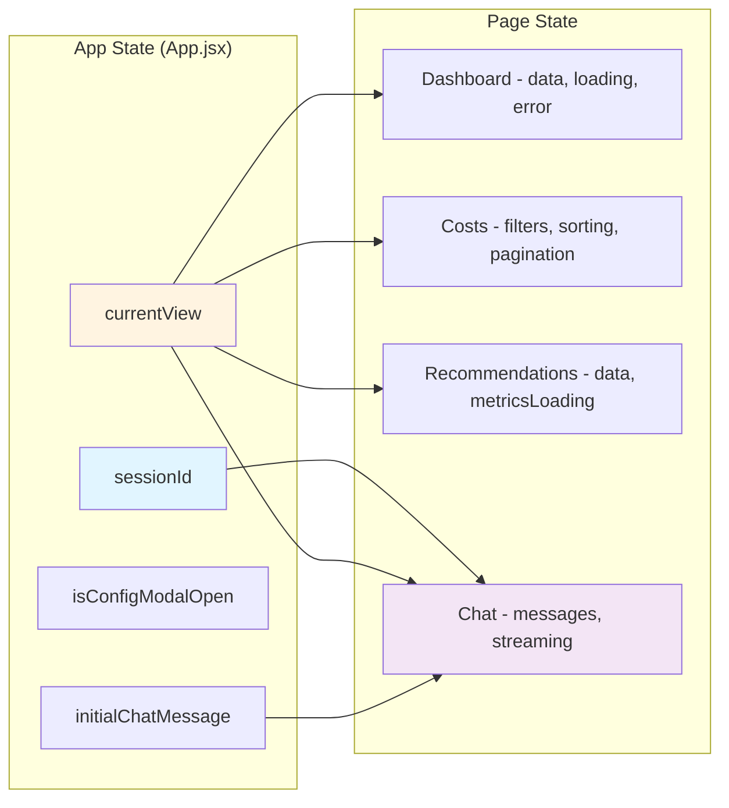

# Cloudey.app Frontend 🎨

> **Beautiful, modern React dashboard for multi-cloud cost optimization**
>
> React 19 + Vite + Tailwind CSS + Framer Motion

---

## 📋 Table of Contents

- [Overview](#overview)
- [Features](#features)
- [Tech Stack](#tech-stack)
- [Architecture](#architecture)
- [Prerequisites](#prerequisites)
- [Installation](#installation)
- [Configuration](#configuration)
- [Running the Application](#running-the-application)
- [Application Structure](#application-structure)
- [Pages & Components](#pages--components)
- [Styling Guide](#styling-guide)
- [Troubleshooting](#troubleshooting)
- [Development](#development)

---

## 🎯 Overview

Cloudey.app's frontend is a single-page application (SPA) that provides an intuitive interface for:
- **Tracking** cloud costs across multiple services and compartments
- **Visualizing** cost trends and resource inventory
- **Discovering** AI-powered optimization recommendations
- **Chatting** with an AI assistant about your infrastructure

### Key Characteristics

✅ **Fast** - Built with Vite for instant hot-reload  
✅ **Modern** - React 19 with latest features  
✅ **Responsive** - Mobile-first Tailwind CSS design  
✅ **Interactive** - Smooth animations with Framer Motion  
✅ **Accessible** - Semantic HTML and ARIA labels  
✅ **Production-Ready** - Optimized builds with code splitting  

---

## ✨ Features

### 🏠 **Dashboard**
- **Cost Overview** - Current month spending with MoM comparison
- **Cost Trends** - 3-month trend chart
- **Resource Inventory** - Quick stats (instances, volumes, buckets, LBs)
- **Cost Alerts** - Budget warnings and anomaly detection
- **Optimization Summary** - Top savings opportunities
- **Quick Actions** - One-click access to key features

### 💰 **Detailed Costs**
- **Service Summary Table** - Cost breakdown by OCI service
- **Top Cost Drivers** - Most expensive resources
- **Compartment Analysis** - Cost by compartment
- **Interactive Tables** - Sorting, searching, filtering (TanStack React Table)
- **Export Ready** - Data formatted for CSV export

### 💡 **AI Insights (Recommendations)**
- **Cost Trend Analysis** - Month-over-month service-level changes
- **Actionable Recommendations** - 10+ types of optimization opportunities
- **Detailed Tables** - Resource-level data with compartments
- **Markdown Rendering** - Rich formatting with tables, bold, lists
- **Metrics Integration** - Real-time CPU/Memory/Bandwidth utilization
- **Savings Calculator** - Estimated monthly savings per recommendation

### 💬 **AI Chat**
- **Natural Language** - Ask questions in plain English
- **Streaming Responses** - Real-time token-by-token output (SSE)
- **Conversation Memory** - Context-aware across the session
- **Tool Integration** - AI can query databases and APIs
- **Session Management** - Multiple conversation threads
- **Markdown Support** - Code blocks, tables, formatting

### ⚙️ **Configuration**
- **OCI Setup** - Easy credential upload wizard
- **Multi-Region** - Support for all OCI regions
- **Secure Storage** - Credentials encrypted server-side
- **Resource Sync** - Manual trigger from UI

---

## 🛠 Tech Stack

### Core Framework
- **React** `19.1+` - Modern UI library with concurrent features
- **Vite** `7.1+` - Lightning-fast build tool and dev server
- **React DOM** `19.1+` - DOM rendering

### UI & Styling
- **Tailwind CSS** `3.4+` - Utility-first CSS framework
- **Tailwind Typography** - Beautiful prose styling
- **Framer Motion** `12.23+` - Animation library
- **Lucide React** `0.552+` - Beautiful icon library (1000+ icons)

### Data & Tables
- **TanStack React Table** `8.21+` - Headless table library
- **React Markdown** `10.1+` - Markdown renderer
- **Remark GFM** `4.0+` - GitHub Flavored Markdown
- **Rehype Raw** `7.0+` - HTML in markdown

### Development
- **ESLint** `9.36+` - Code linting
- **PostCSS** `8.5+` - CSS processing
- **Autoprefixer** `10.4+` - CSS vendor prefixes

---

## 🏗 Architecture

### Application Flow



### Component Hierarchy



### State Management



---

## ✅ Prerequisites

### Required Software

1. **Node.js 18+** and **npm 9+**
   ```bash
   node --version  # Should be v18.0.0 or higher
   npm --version   # Should be 9.0.0 or higher
   ```

2. **Backend Server** running at `http://localhost:8000`
   - See `../backend/README.md` for setup

---

## 📦 Installation

### 1. Navigate to Frontend Directory

```bash
cd cloudey/frontend
```

### 2. Install Dependencies

```bash
npm install
```

This will install all dependencies from `package.json`:
- React 19.1.1
- Vite 7.1.7
- Tailwind CSS 3.4.0
- Framer Motion 12.23.24
- Lucide React 0.552.0
- TanStack React Table 8.21.3
- React Markdown 10.1.0
- And more...

### 3. Verify Installation

```bash
# Should show no vulnerabilities
npm audit

# Check installed versions
npm list react vite tailwindcss
```

---

## ⚙️ Configuration

### Environment Variables

Create a `.env` file in the `frontend/` directory:

```bash
# Backend API URL
VITE_API_URL=http://localhost:8000

# Optional: Enable debug logging
VITE_DEBUG=false
```

**Note:** All Vite environment variables must be prefixed with `VITE_`

### Tailwind Configuration

The app uses a custom Tailwind config (`tailwind.config.js`):

```javascript
/** @type {import('tailwindcss').Config} */
export default {
  content: [
    "./index.html",
    "./src/**/*.{js,ts,jsx,tsx}",
  ],
  theme: {
    extend: {
      typography: {
        DEFAULT: {
          css: {
            maxWidth: 'none',
            // Custom prose styles
          },
        },
      },
    },
  },
  plugins: [
    require('@tailwindcss/typography'),
  ],
}
```

### Vite Configuration

Custom Vite config (`vite.config.js`):

```javascript
import { defineConfig } from 'vite'
import react from '@vitejs/plugin-react'

export default defineConfig({
  plugins: [react()],
  server: {
    port: 3000,
    open: true, // Auto-open browser
  },
})
```

---

## 🚀 Running the Application

### Development Mode (with Hot Reload)

```bash
npm run dev
```

Expected output:
```
VITE v7.1.7  ready in 324 ms

➜  Local:   http://localhost:3000/
➜  Network: http://192.168.1.x:3000/
➜  press h + enter to show help
```

The browser will automatically open at `http://localhost:3000`

**Features in Dev Mode:**
- ⚡ **Instant Hot Reload** - Changes reflect immediately
- 🔍 **Source Maps** - Easy debugging
- 💨 **Fast Refresh** - Preserves component state
- 📊 **Performance Metrics** - HMR update times

### Production Build

```bash
# Build for production
npm run build

# Output in dist/ folder
ls dist/
```

Expected output:
```
dist/
├── assets/
│   ├── index-[hash].js       # Main bundle
│   ├── index-[hash].css      # Styles
│   └── vendor-[hash].js      # Dependencies
└── index.html
```

### Preview Production Build

```bash
# Preview the production build locally
npm run preview
```

Opens at `http://localhost:4173`

### Linting

```bash
# Check for code issues
npm run lint

# Auto-fix issues
npm run lint -- --fix
```

---

## 📁 Application Structure

```
frontend/
├── public/                          # Static assets (served as-is)
│   └── (favicon, images, etc.)
│
├── src/
│   ├── main.jsx                     # Entry point (ReactDOM.render)
│   ├── index.css                    # Global styles + Tailwind imports
│   ├── App.jsx                      # Main app component + routing
│   ├── App.css                      # App-specific styles
│   │
│   ├── components/                  # Reusable components
│   │   ├── ChatInterface.jsx       # AI chat UI with streaming
│   │   ├── ConversationHistory.jsx # Chat session sidebar
│   │   ├── MarkdownMessage.jsx     # Markdown renderer for chat
│   │   ├── OCIConfigModal.jsx      # OCI credential upload modal
│   │   │
│   │   ├── dashboard/              # Dashboard-specific components
│   │   │   ├── CostOverviewCard.jsx        # Monthly cost summary
│   │   │   ├── CostTrendCard.jsx           # 3-month trend chart
│   │   │   ├── ResourceInventoryCard.jsx   # Resource counts
│   │   │   ├── CostAlertsCard.jsx          # Budget warnings
│   │   │   ├── OptimizationSummaryCard.jsx # Top recommendations
│   │   │   └── QuickActionsCard.jsx        # Action buttons
│   │   │
│   │   └── costs/                  # Cost detail components
│   │       ├── ServicesSummaryTable.jsx     # Cost by service
│   │       ├── TopCostDriversTable.jsx      # Most expensive resources
│   │       └── CompartmentCostsTable.jsx    # Cost by compartment
│   │
│   ├── pages/                       # Full-page components
│   │   ├── Dashboard.jsx           # Main dashboard view
│   │   ├── CostsDetail.jsx         # Detailed cost breakdown
│   │   └── Recommendations.jsx     # AI insights & recommendations
│   │
│   ├── utils/                       # Helper functions
│   │   └── api.js                  # API client (fetch wrapper)
│   │
│   └── assets/                      # Images, fonts, etc.
│       └── react.svg
│
├── index.html                       # HTML entry point
├── package.json                     # Dependencies & scripts
├── package-lock.json                # Locked dependency versions
├── vite.config.js                   # Vite configuration
├── tailwind.config.js               # Tailwind CSS configuration
├── postcss.config.js                # PostCSS configuration
├── eslint.config.js                 # ESLint rules
└── README.md                        # This file
```

---

## 📄 Pages & Components

### 1. **Dashboard** (`pages/Dashboard.jsx`)

**Purpose:** High-level cost overview and resource inventory

**Key Features:**
- 📊 **Cost Overview Card** - Current month spend, MoM change, cost breakdown
- 📈 **Cost Trend Card** - 3-month visualization (placeholder for future chart)
- 🗂 **Resource Inventory Card** - Instance, volume, bucket, LB counts
- ⚠️ **Cost Alerts Card** - Budget warnings and anomaly detection
- 💡 **Optimization Summary Card** - Top 3 savings opportunities
- ⚡ **Quick Actions Card** - Navigate to key features

**Data Source:**
```javascript
GET /dashboard/{user_id}
```

**State Management:**
```javascript
const [data, setData] = useState(null);
const [loading, setLoading] = useState(true);
const [error, setError] = useState(null);
```

**Example UI:**
```
┌─────────────────────────────────────────────────────┐
│ Cost Overview                    Resource Inventory │
│ $7,214.82 (+7.8%)                624 Instances      │
│ ● Compute: $3,242.53            3,888 Volumes       │
│ ● Database: $2,202.47           1,513 Buckets       │
│ ● Storage: $604.31               178 Load Balancers │
└─────────────────────────────────────────────────────┘
┌─────────────────────────────────────────────────────┐
│ Cost Alerts                  Optimization Summary   │
│ ⚠️ 12% over budget            🎯 520 underutilized │
│                               💾 969 unattached     │
│                               📦 83 large volumes   │
└─────────────────────────────────────────────────────┘
```

---

### 2. **Costs Detail** (`pages/CostsDetail.jsx`)

**Purpose:** Detailed cost breakdown with interactive tables

**Key Features:**
- **Services Summary Table** - Cost by OCI service (Compute, Database, Storage, etc.)
- **Top Cost Drivers** - Most expensive individual resources
- **Compartment Costs** - Cost aggregated by compartment
- **TanStack React Table** - Sorting, filtering, pagination
- **Export Ready** - Data formatted for CSV/Excel

**Data Source:**
```javascript
GET /costs/detailed?month=2025-10
```

**Tables:**

1. **Services Summary**
   ```
   ┌────────────────┬───────────┬───────────┬────────┐
   │ Service        │ Resources │ Cost      │ %      │
   ├────────────────┼───────────┼───────────┼────────┤
   │ Compute        │ 1,074     │ $3,242.53 │ 44.9%  │
   │ Database       │ 61        │ $2,202.47 │ 30.5%  │
   │ Block Storage  │ 3,888     │ $604.31   │ 8.4%   │
   └────────────────┴───────────┴───────────┴────────┘
   ```

2. **Top Cost Drivers**
   ```
   ┌──────────────────┬──────────┬─────────┬────────────┐
   │ Resource         │ Service  │ Cost    │ Compartment│
   ├──────────────────┼──────────┼─────────┼────────────┤
   │ prod-db-master   │ Database │ $850.32 │ bby_prod   │
   │ app-cluster-01   │ Compute  │ $425.18 │ bby_prod   │
   └──────────────────┴──────────┴─────────┴────────────┘
   ```

**Interactive Features:**
- Click column headers to sort
- Search/filter by service or compartment
- Pagination (10/25/50 per page)

---

### 3. **AI Insights** (`pages/Recommendations.jsx`)

**Purpose:** AI-powered cost optimization recommendations

**Key Features:**
- **Cost Trend Insights** - Service-level month-over-month analysis
- **Dominant Service Analysis** - Deep dive into top cost drivers
- **Resource-Based Recommendations** - 10+ optimization types
- **Detailed Tables** - Resource-level data with compartments
- **Markdown Rendering** - Tables, bold, lists
- **Metrics Integration** - Real CPU/Memory/Bandwidth data
- **Refresh Metrics Button** - Trigger OCI Monitoring sync

**Data Source:**
```javascript
GET /recommendations/{user_id}
```

**Recommendation Types:**
1. 🛑 **Stopped Instances** - Costing $50/mo each for storage
2. 💾 **Unattached Volumes** - Orphaned block storage
3. 📦 **Large Volumes** - Performance tier optimization
4. 🎯 **Instance Rightsizing** - Underutilized instances (CPU/Memory <40%)
5. ⏰ **Non-Prod Scheduling** - Dev/test instances running 24/7
6. 🔄 **Underutilized Load Balancers** - Low bandwidth (<10 Mbps)
7. 💰 **Reserved Capacity** - 1-year commitment (38% savings)
8. 📦 **Object Storage Tiers** - Archive tier opportunities

**Example Output:**
```
┌──────────────────────────────────────────────────────────────┐
│ 🎯 520 instance(s) for rightsizing review                   │
│ Save ~$65,000/mo                                             │
├──────────────────────────────────────────────────────────────┤
│ ✅ 520 confirmed underutilized (with monitoring data):      │
│                                                              │
│ ┌──────────┬─────────────┬─────────┬──────┬────────┬──────┐│
│ │ Instance │ Compartment │ Shape   │ CPU% │ Mem%   │ Rec  ││
│ ├──────────┼─────────────┼─────────┼──────┼────────┼──────┤│
│ │ web-01   │ bby_prod    │ 16v/128G│ 12%  │ 18%    │ 8v/64││
│ │ api-02   │ bby_prod    │ 8v/64G  │ 8%   │ 15%    │ 6v/48││
│ └──────────┴─────────────┴─────────┴──────┴────────┴──────┘│
│                                                              │
│ Estimated Savings: ~$65,000/month by rightsizing           │
└──────────────────────────────────────────────────────────────┘
```

**Markdown Parsing:**
- **Tables** → HTML `<table>` with borders
- **Bold** (`**text**`) → `<strong>` tags
- **Bullets** (`•` or `-`) → Indented `<div>`
- **Numbered lists** → Indented `<div>`

**Actions:**
- **"Refresh"** - Regenerate recommendations
- **"Refresh Metrics"** - Sync OCI Monitoring data (CPU, Memory, Bandwidth)
- **"Ask AI about..."** - Navigate to chat with context

---

### 4. **AI Chat** (`components/ChatInterface.jsx`)

**Purpose:** Conversational AI for cost analysis

**Key Features:**
- **Streaming Responses** - Real-time token-by-token (Server-Sent Events)
- **Conversation Memory** - Context-aware across session
- **Tool Integration** - AI can query databases and call OCI APIs
- **Session Management** - Multiple conversation threads
- **Markdown Support** - Code blocks, tables, bold, lists
- **Suggested Questions** - Quick-start prompts

**Data Source:**
```javascript
POST /chat/stream/{user_id}
Body: {
  "message": "Show me costs for bby_prod",
  "thread_id": "session-12345"
}
```

**AI Capabilities:**
- Query cached costs (fast)
- List resources (instances, volumes, buckets)
- Analyze cost trends
- Compare compartments
- Get top cost drivers
- List compartments
- Get OCI cost summary
- Live OCI API calls (slower)

**Example Conversation:**
```
User: "Show me costs for bby_prod in October"

AI: (streams response)
"Looking up costs for compartment bby_prod...

Found costs for October 2025:
• Compute: $1,250.32 (45%)
• Database: $850.18 (31%)
• Block Storage: $325.44 (12%)
• Load Balancer: $215.88 (8%)

Total: $2,741.82

The top cost driver is your compute instances, with 
'prod-app-cluster-01' alone costing $425/month."

User: "Compare that to amc_prod"

AI: (remembers context, compares)
"Comparing bby_prod ($2,741.82) to amc_prod ($3,145.67):

amc_prod costs 14.7% more (+$403.85/month).

Main differences:
• Compute: amc_prod has 15 more instances
• Database: Similar spending (~$850/mo each)
• Storage: amc_prod uses 2TB more"
```

**Session Management:**
- **New Chat** - Creates new session ID
- **Conversation History** - Sidebar with past sessions
- **Load Session** - Resume previous conversation
- **Persistent** - Stored in PostgreSQL via LangGraph checkpoints

---

### 5. **OCI Config Modal** (`components/OCIConfigModal.jsx`)

**Purpose:** Upload OCI credentials securely

**Fields:**
- Email (identifies user)
- Tenancy OCID
- User OCID
- Fingerprint
- Region (dropdown with all OCI regions)
- Private Key (.pem file upload)

**Flow:**
1. User clicks "OCI Config" button
2. Modal opens with form
3. User fills fields and uploads .pem file
4. Frontend sends to `POST /oci-config/{user_id}`
5. Backend encrypts private key
6. Credentials stored in PostgreSQL
7. Modal closes, user can now sync resources

**Security:**
- Private key is encrypted server-side (Fernet)
- Never stored in frontend state
- HTTPS recommended for production

---

## 🎨 Styling Guide

### Tailwind CSS Classes

**Common Patterns:**

1. **Cards:**
   ```jsx
   <div className="bg-white rounded-lg shadow-md p-6 border border-gray-200">
     {/* content */}
   </div>
   ```

2. **Buttons:**
   ```jsx
   // Primary
   <button className="bg-blue-600 text-white px-4 py-2 rounded-lg hover:bg-blue-700 transition">

   // Secondary
   <button className="bg-gray-100 text-gray-700 px-4 py-2 rounded-lg hover:bg-gray-200 transition">

   // Danger
   <button className="bg-red-600 text-white px-4 py-2 rounded-lg hover:bg-red-700 transition">
   ```

3. **Tables:**
   ```jsx
   <table className="min-w-full text-xs border-collapse">
     <thead className="bg-gray-100">
       <tr>
         <th className="border border-gray-300 px-2 py-1 text-left font-semibold">
           Header
         </th>
       </tr>
     </thead>
     <tbody>
       <tr className="bg-white">
         <td className="border border-gray-300 px-2 py-1">
           Cell
         </td>
       </tr>
     </tbody>
   </table>
   ```

4. **Status Badges:**
   ```jsx
   // Success
   <span className="px-2 py-1 bg-green-100 text-green-800 rounded-full text-xs">

   // Warning
   <span className="px-2 py-1 bg-yellow-100 text-yellow-800 rounded-full text-xs">

   // Error
   <span className="px-2 py-1 bg-red-100 text-red-800 rounded-full text-xs">
   ```

### Color Palette

**Primary Colors:**
- Blue: `bg-blue-50` to `bg-blue-900`
- Indigo: `bg-indigo-50` to `bg-indigo-900`

**Status Colors:**
- Success: `bg-green-100`, `text-green-800`
- Warning: `bg-yellow-100`, `text-yellow-800`
- Error: `bg-red-100`, `text-red-800`
- Info: `bg-blue-100`, `text-blue-800`

**Neutrals:**
- Backgrounds: `bg-gray-50`, `bg-gray-100`
- Text: `text-gray-600`, `text-gray-700`, `text-gray-900`
- Borders: `border-gray-200`, `border-gray-300`

### Responsive Design

**Breakpoints:**
```javascript
sm: '640px'   // Mobile landscape
md: '768px'   // Tablet
lg: '1024px'  // Desktop
xl: '1280px'  // Large desktop
2xl: '1536px' // Extra large
```

**Example:**
```jsx
<div className="grid grid-cols-1 md:grid-cols-2 lg:grid-cols-3 gap-4">
  {/* 1 column on mobile, 2 on tablet, 3 on desktop */}
</div>
```

### Animations

**Using Framer Motion:**
```jsx
import { motion } from 'framer-motion';

<motion.div
  initial={{ opacity: 0, y: 20 }}
  animate={{ opacity: 1, y: 0 }}
  transition={{ duration: 0.5 }}
>
  {/* content */}
</motion.div>
```

**Common Animations:**
- Fade in: `opacity: 0 → 1`
- Slide up: `y: 20 → 0`
- Scale: `scale: 0.95 → 1`

---

## 🔧 Troubleshooting

### Common Issues

#### 1. **npm install fails**

**Error:**
```
npm ERR! code ERESOLVE
npm ERR! ERESOLVE unable to resolve dependency tree
```

**Solutions:**
```bash
# Clear npm cache
npm cache clean --force

# Delete node_modules and package-lock.json
rm -rf node_modules package-lock.json

# Reinstall
npm install

# If still fails, use legacy peer deps
npm install --legacy-peer-deps
```

---

#### 2. **Vite dev server won't start**

**Error:**
```
Error: Cannot find module 'vite'
```

**Solutions:**
```bash
# Ensure you're in the frontend directory
cd frontend
pwd  # Should show .../cloudey/frontend

# Reinstall dependencies
npm install

# Check if vite is installed
npm list vite
```

---

#### 3. **Backend API not reachable**

**Error:**
```
Failed to fetch
TypeError: fetch failed
```

**Solutions:**
```bash
# Check if backend is running
curl http://localhost:8000
# Should return: {"message": "Cloudey.app API"}

# Check .env file
cat .env
# Should have: VITE_API_URL=http://localhost:8000

# Restart frontend dev server
npm run dev
```

---

#### 4. **Tailwind styles not working**

**Symptoms:**
- No styling applied
- Classes like `bg-blue-500` not working

**Solutions:**
```bash
# Check tailwind.config.js exists
ls tailwind.config.js

# Ensure index.css has Tailwind imports
cat src/index.css | grep @tailwind
# Should show:
# @tailwind base;
# @tailwind components;
# @tailwind utilities;

# Restart dev server
npm run dev
```

---

#### 5. **Table not rendering**

**Symptoms:**
- Markdown tables show as plain text
- HTML `<table>` not displaying

**Solutions:**
```javascript
// Check renderMarkdown function in Recommendations.jsx
// Should parse "|---" as table separator

// Verify table syntax:
// Header row: | Col1 | Col2 |
// Separator:  |------|------|
// Data rows:  | val1 | val2 |
```

---

#### 6. **Chat not streaming**

**Symptoms:**
- Chat waits for full response
- No token-by-token display

**Solutions:**
```javascript
// Check if SSE is working
fetch('http://localhost:8000/chat/stream/1', {
  method: 'POST',
  headers: { 'Content-Type': 'application/json' },
  body: JSON.stringify({
    message: "test",
    thread_id: "test-123"
  })
})
.then(response => {
  const reader = response.body.getReader();
  // Should stream data chunks
});

// Verify backend is using StreamingResponse
// Check backend/app/main.py @app.post("/chat/stream/{user_id}")
```

---

#### 7. **Icons not showing (Lucide)**

**Symptoms:**
- Blank spaces where icons should be
- Console errors about Lucide components

**Solutions:**
```bash
# Reinstall lucide-react
npm uninstall lucide-react
npm install lucide-react@latest

# Check import syntax
# Correct:
import { DollarSign, TrendingUp } from 'lucide-react';

# Incorrect:
import DollarSign from 'lucide-react';  // ❌
```

---

#### 8. **Build fails with "out of memory"**

**Error:**
```
FATAL ERROR: Reached heap limit Allocation failed
```

**Solutions:**
```bash
# Increase Node memory limit
export NODE_OPTIONS="--max-old-space-size=4096"

# Then build
npm run build

# Or use the command directly
NODE_OPTIONS="--max-old-space-size=4096" npm run build
```

---

### Debugging Tips

#### Enable React DevTools

```bash
# Install React DevTools browser extension
# Chrome: https://chrome.google.com/webstore/detail/react-developer-tools
# Firefox: https://addons.mozilla.org/en-US/firefox/addon/react-devtools/
```

#### Check Console Logs

```javascript
// Add debug logging in components
console.log('[Dashboard] Data loaded:', data);
console.log('[API] Request:', url, options);
console.log('[State] Current view:', currentView);
```

#### Network Tab

1. Open browser DevTools (F12)
2. Go to Network tab
3. Filter by "Fetch/XHR"
4. Check API request/response
5. Look for errors (4xx, 5xx)

#### React Strict Mode

```jsx
// In main.jsx
<React.StrictMode>
  <App />
</React.StrictMode>
```

This runs components twice in development to catch side effects.

---

## 💻 Development

### Adding a New Page

1. **Create page component** (`src/pages/NewPage.jsx`)
   ```jsx
   export default function NewPage({ userId }) {
     const [data, setData] = useState(null);
     const [loading, setLoading] = useState(true);
     
     useEffect(() => {
       fetchData();
     }, [userId]);
     
     const fetchData = async () => {
       // API call
     };
     
     return (
       <div>
         <h1>New Page</h1>
         {/* content */}
       </div>
     );
   }
   ```

2. **Add route in App.jsx**
   ```jsx
   import NewPage from './pages/NewPage';
   
   // In state
   const [currentView, setCurrentView] = useState('dashboard');
   // Add 'newpage' as option
   
   // In navigation
   <button onClick={() => setCurrentView('newpage')}>
     New Page
   </button>
   
   // In view rendering
   {currentView === 'newpage' && <NewPage userId={userId} />}
   ```

3. **Add navigation button**
   ```jsx
   <button
     onClick={() => setCurrentView('newpage')}
     className={`flex items-center space-x-2 px-4 py-2 rounded-lg ${
       currentView === 'newpage' 
         ? 'bg-blue-100 text-blue-700' 
         : 'text-gray-600 hover:bg-gray-100'
     }`}
   >
     <Icon className="w-5 h-5" />
     <span>New Page</span>
   </button>
   ```

### Adding a New Component

1. **Create component file** (`src/components/NewComponent.jsx`)
   ```jsx
   export default function NewComponent({ data, onAction }) {
     return (
       <div className="bg-white rounded-lg shadow-md p-6">
         {/* component content */}
       </div>
     );
   }
   ```

2. **Import in parent**
   ```jsx
   import NewComponent from './components/NewComponent';
   
   // In render
   <NewComponent 
     data={someData} 
     onAction={handleAction} 
   />
   ```

### API Integration

**Use the API utility** (`src/utils/api.js`):

```javascript
// In your component
const fetchData = async () => {
  try {
    const response = await fetch(
      `${import.meta.env.VITE_API_URL}/endpoint/${userId}`
    );
    
    if (!response.ok) {
      throw new Error('API request failed');
    }
    
    const data = await response.json();
    setData(data);
  } catch (err) {
    setError(err.message);
  } finally {
    setLoading(false);
  }
};
```

### Code Formatting

**Use ESLint:**
```bash
# Check for issues
npm run lint

# Auto-fix
npm run lint -- --fix
```

**Common Rules:**
- No unused variables
- Consistent spacing
- Prop types validation (recommended)
- No console.log in production (warning)

### Performance Optimization

1. **Use React.memo for expensive components:**
   ```jsx
   const ExpensiveComponent = React.memo(({ data }) => {
     // Heavy computation
     return <div>{/* render */}</div>;
   });
   ```

2. **Lazy load pages:**
   ```jsx
   import { lazy, Suspense } from 'react';
   
   const Dashboard = lazy(() => import('./pages/Dashboard'));
   
   // In render
   <Suspense fallback={<Loading />}>
     <Dashboard />
   </Suspense>
   ```

3. **Debounce expensive operations:**
   ```javascript
   const debounce = (func, wait) => {
     let timeout;
     return (...args) => {
       clearTimeout(timeout);
       timeout = setTimeout(() => func(...args), wait);
     };
   };
   
   const debouncedSearch = debounce(handleSearch, 300);
   ```

### Testing (Future)

**Recommended:**
- **Vitest** - Unit testing
- **React Testing Library** - Component testing
- **Playwright** - E2E testing

```bash
# Install test dependencies
npm install -D vitest @testing-library/react @testing-library/jest-dom

# Run tests
npm test
```

---

## 📚 Additional Resources

### Documentation
- [React Docs](https://react.dev)
- [Vite Docs](https://vite.dev)
- [Tailwind CSS](https://tailwindcss.com/docs)
- [Framer Motion](https://www.framer.com/motion/)
- [TanStack Table](https://tanstack.com/table/latest)
- [Lucide Icons](https://lucide.dev)

### Related Files
- Backend README: `../backend/README.md`
- Docker Compose: `../docker-compose.yml`
- API Documentation: `http://localhost:8000/docs` (when backend is running)

---

## 📝 Notes

### Browser Support

**Minimum Versions:**
- Chrome 90+
- Firefox 88+
- Safari 14+
- Edge 90+

**Features Required:**
- ES2020 support
- CSS Grid
- Flexbox
- Fetch API
- Server-Sent Events (for chat streaming)

### Performance Targets

- **First Load:** < 2s
- **Route Change:** < 300ms
- **API Response:** < 1s (cached), < 5s (live OCI)
- **Chat Stream:** Real-time (SSE)

### Security Considerations

- ⚠️ No authentication layer (add JWT for production)
- ⚠️ CORS enabled for `localhost:3000` (restrict in production)
- ✅ No secrets in frontend code
- ✅ API keys stored server-side only
- ✅ HTTPS recommended for production

### Future Enhancements

- [ ] User authentication (JWT)
- [ ] Dark mode
- [ ] Cost charts (Chart.js or Recharts)
- [ ] Export to CSV/PDF
- [ ] Budget alerts with email notifications
- [ ] Multi-cloud support (AWS, Azure)
- [ ] Saved queries
- [ ] Custom dashboards
- [ ] Mobile app (React Native)

---

## 🤝 Contributing

1. Fork the repository
2. Create a feature branch (`git checkout -b feature/amazing-feature`)
3. Commit your changes (`git commit -m 'Add amazing feature'`)
4. Push to the branch (`git push origin feature/amazing-feature`)
5. Open a Pull Request

**Code Style:**
- Use Tailwind CSS (no custom CSS unless necessary)
- Follow React best practices
- Keep components small and focused
- Write meaningful commit messages

---

## 📄 License

Proprietary - All rights reserved

---

## 👥 Support

For questions or issues:
- **Email**: support@cloudey.app
- **Docs**: https://docs.cloudey.app
- **Issues**: https://github.com/your-org/cloudey/issues

---

**Built with ❤️ by the Cloudey team**
